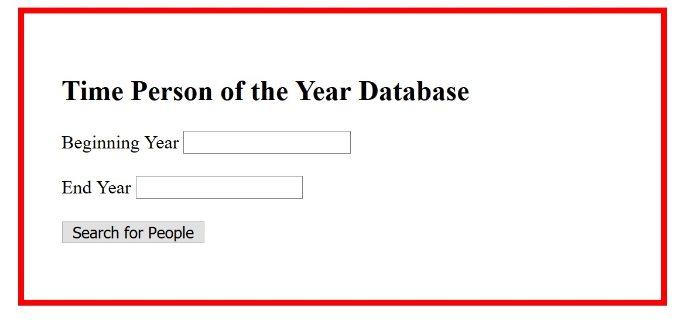
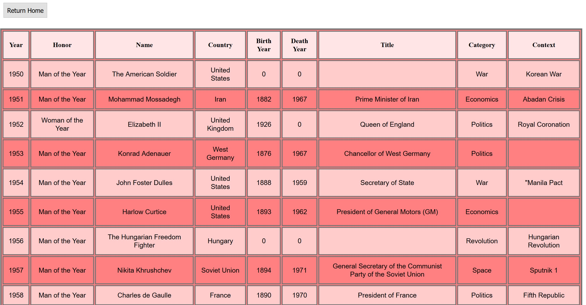

# Lab-11-My-First-MVC-App
 CODE: Intro to MVC &amp; Core assignment for Code Fellows 401 C#/.NET course

**Author**: Earl Jay Caoile  
**Version**: 1.0.0

## Overview
This MVC web application allows users to search through 
a database of Time Person of the Year receipients. Users enter a beginning and
end year. They are taken to a page with a listing shown as a table.

## Getting Started
The following is required to run the program.
1. Visual Studio 2017 
2. The .NET desktop development workload enabled
3. no external packages required for this application

## Example

## Happy path
- open home page
- enter a beginning year (1950)
- enter an end year (2010)
- view list
- smile

## Architecture
This application is created using ASP.NET Core 2.1 Web Application  
*Languages*: C#, HTML, CSS  
*Type of Applicaiton*: Web Application  

## Change Log
06-19-2018 9:00 AM - initial scaffolding  
06-19-2018 11:00 AM - time person class and filter created 
06-19-2018 1:00 PM - wired up home page with search results 
06-19-2018 4:00 PM - added styling to both pages 
06-19-2018 5:00 PM - finished readme 

